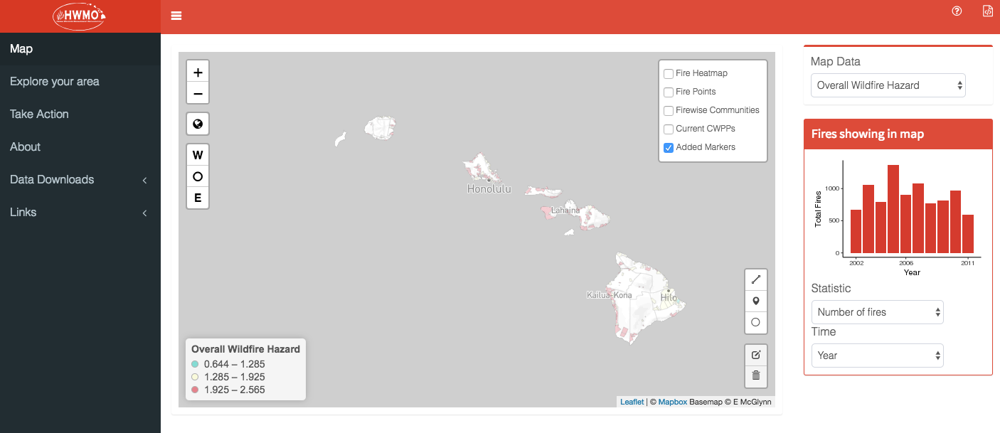
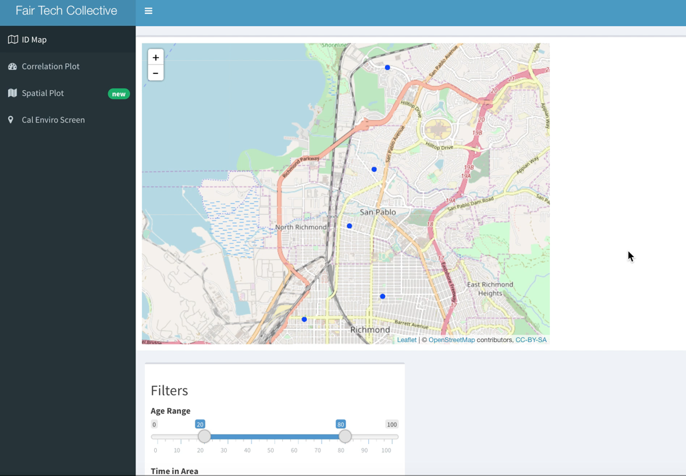

 

My academic work has mostly focused on the dream of data solving sustainable production and consumption. With that as the backbone, my dissertation spanned consumer behavior change efforts, factory innovations, and non-governmental regulation. Most of this research was focused on the apparel industry, and took place in Thailand, Bangladesh, and China. I also have experience with data science projects relating to wildfires, oil refinery pollution, and the social cost of carbon. I have teaching experience in data ethics as well as data science and sustainability.

I aim for real world relevance and academic rigor, and I often work with partners outside academia. I have been funded by the National Science Foundation as well as grants from the Tides Foundation and C&A Foundation. 

## Work {.tabset}

### Select Peer-Reviewed Publications
1. Lollo, Niklas, and Dara O’Rourke. “Factory Benefits to Paying Workers More: The Critical Role of Compensation Systems in Apparel Manufacturing.” Edited by Shihe Fu. PLOS ONE 15, no. 2 (February 5, 2020): e0227510. https://doi.org/10.1371/journal.pone.0227510.

2. Moore, Frances C., James Rising, Niklas Lollo, Cecilia Springer, Valeri Vasquez, Alex Dolginow, Chris Hope, and David Anthoff. “Mimi-PAGE, an Open-Source Implementation of the PAGE09 Integrated Assessment Model.” Scientific Data 5, no. 180187 (2018). https://doi.org/10.1038/sdata.2018.187.

3. O’Rourke, Dara, and Niklas Lollo. Transforming Consumption: From Decoupling, to Behavior Change, to System Changes for Sustainable Consumption. Annual Review of Environment and Resources. Vol. 40, 2015. https://doi.org/10.1146/annurev-environ-102014-021224.

See [Google Scholar](https://scholar.google.com/citations?user=B3P77eAAAAAJ&hl=en) for an up-to-date list.

### Data Science Projects
 1. [Hawaii Wildfire Management Organization](https://bnhm-shiny.berkeley.edu/HWMO/)  
 Designed and programmed an RShiny App that maps historical wildfires, risk assessments, and
provides fire preparedness guidance.
  

  
 
 2. [Real Time Health Monitoring](https://www.fairtechcollective.org/experiments/)  
Designed and programmed dynamic RShiny App for citizen-science data analysis. Project aiming to link Bay Area refinery pollution data to personal health outcomes.
  

  
 
 3. [Mimi-PAGE - An Open-Source Implementation of the PAGE09 Integrated Assessment Model](https://github.com/anthofflab/mimi-page.jl.git)  
 Coded PAGE IAM in Julia using MIMI framework.

### CV
<embed src="LolloResume_summary.pdf" width="600" height="500"> </embed>
[Resume](LolloResume_summary.pdf) | [CV](AcademicCV_Lollo_2020.pdf)
 